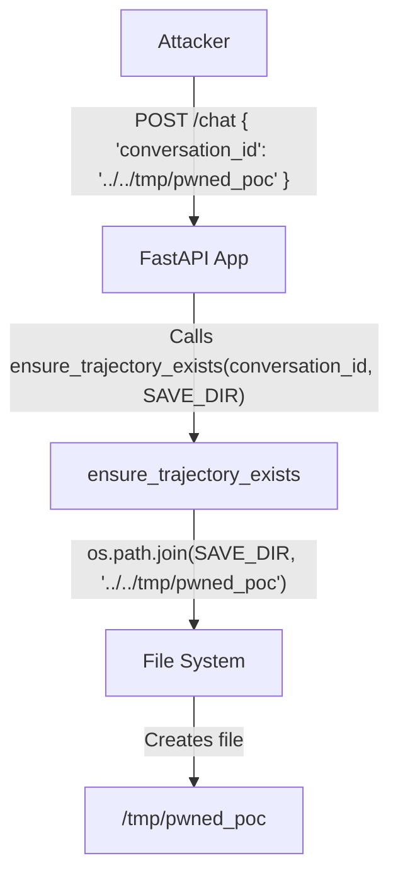

# Path Traversal in conversation_id

## Executive Summary
The `Meal Planning Agent Service` is vulnerable to a path traversal attack via the `conversation_id` parameter in the `/chat` endpoint. An attacker can provide a malicious `conversation_id` containing path traversal sequences (e.g., `../../`) to create or potentially access files outside the intended conversation directory. This can lead to unauthorized file creation and potentially further exploitation depending on how these files are used by the system.

## Root Cause Analysis
The vulnerability exists in `app.py` because the `conversation_id` provided by the user in the POST request to `/chat` is not validated before being passed to `ensure_trajectory_exists()`, which performs file system operations.

In `app.py`:
```python
@app.post("/chat", response_model=ChatResponse)
async def chat(request: ChatRequest, x_user_id: Annotated[str | None, Header()] = None):
    """Chat endpoint for interacting with the agent."""
    if not request.message.strip():
        raise HTTPException(status_code=400, detail="Message cannot be empty")

    # Generate a new conversation ID if not provided
    conversation_id = request.conversation_id or str(uuid.uuid4())

    # ... (omitted user ID logic)

    # Validate conversation_id to prevent path traversal
    # if request.conversation_id and (
    #     os.path.basename(request.conversation_id) != request.conversation_id
    #     or ".." in request.conversation_id
    # ):
    #     raise HTTPException(status_code=400, detail="Invalid conversation_id")

    # ... (omitted user ID logic)

    # Ensure the trajectory file exists so the harness doesn't fail
    ensure_trajectory_exists(conversation_id, SAVE_DIR)
```

The validation code that would have prevented this is present but commented out. The `ensure_trajectory_exists` function (based on its usage and name) uses `conversation_id` to construct a file path.

## Threat Model Analysis
- **Attacker Role**: Any user who can send a POST request to the `/chat` endpoint.
- **Trust Boundary**: The application trusts the `conversation_id` provided in the JSON request body.
- **Impact**: An attacker can specify an arbitrary path for the trajectory file. This allows creating files in arbitrary locations on the server where the application has write permissions.

## Exploitation & Reproduction

### Scenario
An attacker sends a chat request with a `conversation_id` set to `../../tmp/pwned_poc`.

### Reproduction Steps
1. Start the `Meal Planning Agent Service`.
2. Send a POST request to `/chat` with a malicious `conversation_id`.
3. Observe that a file is created at `/tmp/pwned_poc`.

### Mermaid Diagram


## Fix Recommendation
Uncomment and enable the validation logic for `conversation_id` in `app.py`.

```python
    # Validate conversation_id to prevent path traversal
    if request.conversation_id and (
        os.path.basename(request.conversation_id) != request.conversation_id
        or ".." in request.conversation_id
    ):
        raise HTTPException(status_code=400, detail="Invalid conversation_id")
```
